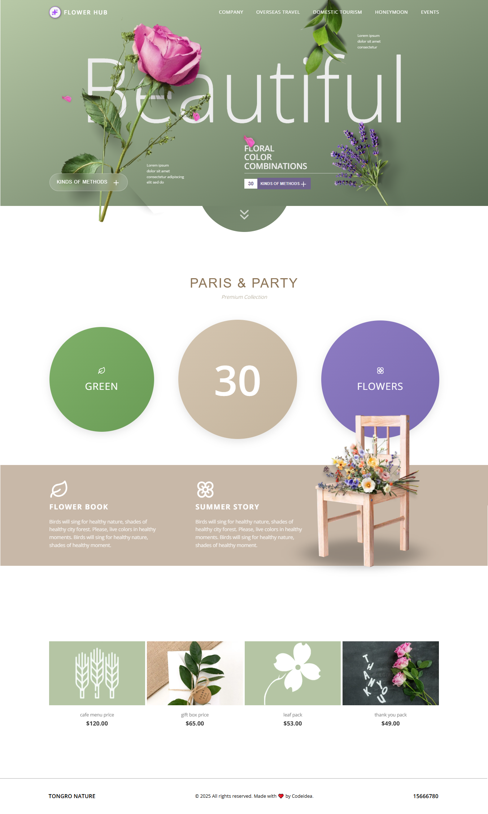

# Flower Hub 🌸

Landing page for a flower shop, built with Next.js and GSAP animations.




---

## 🔍 Overview

A simple and elegant landing page with:
- Smooth scroll animations
- Clean and soft UI design
- Fully responsive (mobile + tablet friendly)

---

## 🚀 Live Demo

[🌐 View Live on Vercel](https://flower-hub.vercel.app)

---

##  Built With

- Next.js 14 (App Router)
- CSS Modules
- Photoshop (for image editing)

---

## 👩‍💻 Developed by Saja Ahmed

Feel free to explore, but **please don’t use without attribution**
---

## How to Use

```bash
git clone https://github.com/username/project-name.git
cd project-name
npm install
npm run dev
